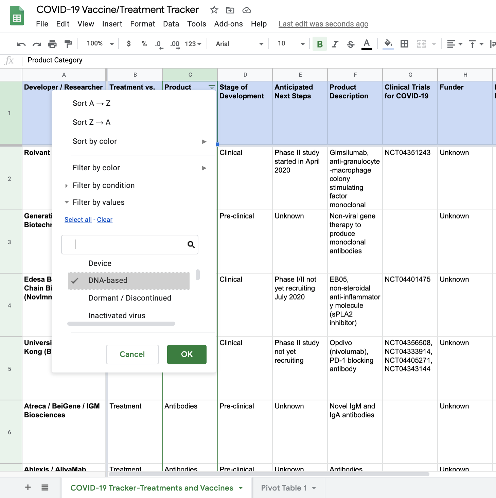
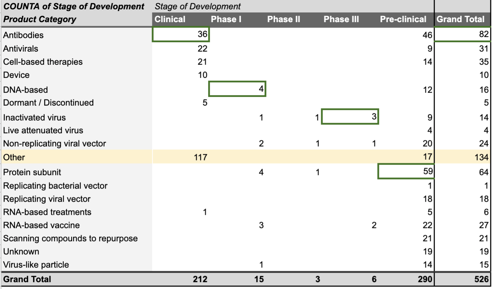

# COVID-19 Vaccine/Treatment Tracker
<h3>Mehak Sharma | Journalism 124 | Summer 2020</h3>

For my final project, I looked at a dataset pertaining to COVID-19 vaccines and treatments. This data was obtained from [the Milken Institute's COVID-19 Tracker](https://covid-19tracker.milkeninstitute.org/). The Milken Institute’s FasterCures project is tracking hundreds of potential COVID-19 treatments and vaccines. For each candidate, the project’s database lists its category (e.g., DNA-based vaccines, cell-based therapies, et cetera), a brief description, its stage of development, “anticipated next steps,” funders, published results, FDA-Approved indications, and more.

[Link to data](https://airtable.com/shrSAi6t5WFwqo3GM/tblEzPQS5fnc0FHYR/viweyymxOAtNvo7yH?blocks=bipZFzhJ7wHPv7x9z)

For most of these fields, not much cleaning was needed. I noticed some count errors while making pivot tables, which I then fixed by "trimming" certain values as there was an extra space at the end of the value, which prevented it from being categorized and counted correctly.

<h3>Initial Data Exploration</h3>

  

I began exploring the data by putting filters on fields I thought may show interesting results, specifically the category types (e.g., DNA-based vaccines, cell-based therapies, et cetera) and the development stages. After filtering for certain types and stages, I took a look at the different product descriptions, FDA indications, and funders, to get a better sense of the landscape. Through this initial exploration, I was able to see a correlation between the category types and development stages, which I decided to further explore using other methods.

<h3>Breakdown by Vaccine/Treatment Category</h3>

I used Datawrapper to produce a donut-hole diagram depicting the breakdown of all known COVID-19 vaccines and treatments by category type. Aside from the "Other" category, the leading contender of the 526 options was an antibody-based vaccine, leading me to wonder if there was a relationship between the prevalence of antibody-based vaccines and its success in development phases, which can be gauged by how far antibody vaccines have made it in clinical trials and Phase I/II/III testing.

<iframe title="Vaccine/Treatment Categories" aria-label="chart" id="datawrapper-chart-K8Gso" src="https://datawrapper.dwcdn.net/K8Gso/1/" scrolling="no" frameborder="0" style="width: 0; min-width: 100% !important; border: none;" height="408"></iframe>

<h3>Relationship between Category and Development Stage</h3>

Following my observation regarding the prevalence of antibody-based vaccines, I created a pivot table on Google Sheets to visualize the relationship between category and development stage to see if there were any trends, highlighting the top vaccine/treatment category types in each phase of development.

Then, I transferred this pivot table to Datawrapper to create a searchable, cleaner version, as seen below. 

<iframe title="Category and Development Stage" aria-label="chart" id="datawrapper-chart-upKyE" src="https://datawrapper.dwcdn.net/upKyE/1/" scrolling="no" frameborder="0" style="width: 0; min-width: 100% !important; border: none;" height="1120"></iframe>

It appears that although antibody-based vaccines make up a large portion of the 526 total vaccines and treatments being tracked, all of them are either in pre-clinical and clinical stages. On the other hand, the only options that have made it to Phase III testing are inactivated viruses (3), non-replicating viral vectors (1), and RNA-based vaccines (2). 

Returning to the initial dataset, I focused on more details regarding the specific options that are currently in the Phase III stage by filtering. In the United States, it seems that RNA-based vaccines might be leading the charge, given recent news regarding the success of the Moderna-NIH collaboration on an RNA-based vaccine as well as Pfizer's involvement in a similar project with Chinese and German drug makers. Although they have not yet brought a product to market, Moderna develops vaccines based on messenger RNA (mRNA) to produce viral proteins in the body. The Moderna-NIH collaboration has been found to protect monkeys from the coronavirus. In March, the company put the first Covid-19 vaccine into human trials, which yielded promising results. The Phase III trial began on July 27th and enrolled 30,000 healthy people at about 89 sites around the United States. The federal government is financing Moderna’s efforts with nearly $1 billion in support.

Globally, the main approach from drug manufacturers seems to be based on inactivated virus; many China-based investors appear to make up the majority of these options.

<h3>Conclusion</h3>

Some additional data I made efforts to find for this project including more information about the funding for vaccine/treatment research - a crucial one being the U.S. government's Operation Warp Speed, as well as other global governmental and institutional funders. Unfortunately, I was unable to find a comprehensive dataset on any of these topics.

I also looked into global vaccine coverage data. Although I was able to find relevant datasets showing the coverage of specific vaccines in global areas (and even by county in the U.S.), I decided not to include this data in my analysis due to the unprecedented nature of COVID-19. Vaccination data for other diseases/outbreaks, however accurate, is difficult to translate to a pandemic at the scale of what we are currently experiencing, and similar ones occurred far too long ago for that data to be indicative or reflective of our current medical technology and approaches.

Another visualization I considered making was a global map depicting the types/prevalence of certain vaccine/treatment categories by country, since we can see a disparity between approaches globally. This was too difficult to do since the "Funder" field in the dataset would have required extensive cleaning and more research, since many of the values simply gave a company name without mentioning where it was based. However, I believe this would be an interesting analysis given the global nature of this pandemic. It will be fascinating to see how these different approaches will affect national responses, and whether countries will try to focus on one treatment type or try to encourage imports and exports of the vaccine whether it is developed, since many countries have already adopted nationalist, closed-border policies with regards to materials.
